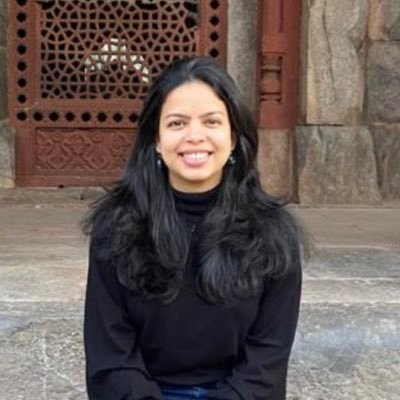

```{r setup, include=FALSE}
knitr::opts_chunk$set(echo = FALSE)
```

<br>

<div class="col2">   

I am currently working on peer learning among locally elected politicians in Bihar. I am interested in topics related to Development, Economic History, Political Economy, and Deep Learning.

Previously, I worked with Michael Walton as a senior research associate at IMAGO Global Grassroots on rural governance projects that involve analyzing novel datasets.

Before that, I worked as a Research Associate at J-PAL South Asia working with Dr. Seema Jayachnadran and Dr. Diva Dhar on a gender-transformative education program in Haryana and IFMR-LEAD.

I have a Master’s degree in Public Policy from Azim Premji University and a Bachelor’s degree in Social Scinces from Tata Institute of Social Scinces.

I am skilled in the use of Python, R, and Stata for data analysis.
 </div>

<div class="col2">

 </div>

